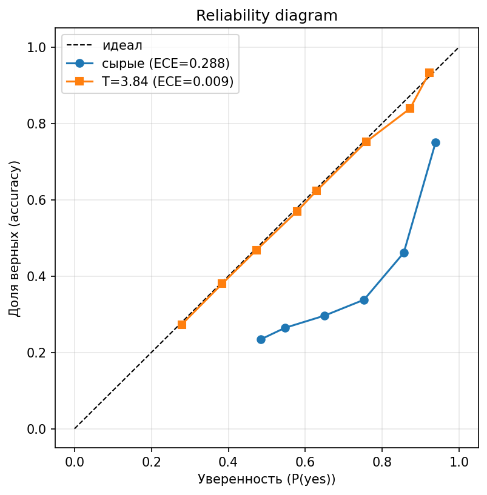

# 🏛️ AI Tour Guide

**Распознавание достопримечательностей по фотографии на русском языке.**
Загружаете фото — получаете название объекта, экскурсионное описание и уверенность модели. Если объекта нет в галерее, сервис не выдумывает: включает fallback — ищет в интернете (Yandex Image Search → Wikipedia) с повторной VLM-верификацией, а при её неудаче честно отвечает «не знаю».

<div align="center">


</div>


---

## Коротко о результате

Задача — **распознавание достопримечательностей по фото в режиме open-set identification**: по снимку найти объект в галерее **или** отклонить его, если объекта в базе нет. Галерея сменяемая (объекты добавляются без переобучения), матчинг — retrieval + попарная верификация. Решение — двухступенчатый пайплайн **retrieve → rerank** с дообученным vision-language-ранкером.

| | Hit@1 | MRR |
|---|:---:|:---:|
| Retrieval baseline (SigLIP + FAISS) | 60.74% | 0.711 |
| Zero-shot Qwen2-VL (без дообучения) | 26.98% | 0.465 |
| **LoRA-reranker (итоговая модель)** | **73.51%** | **0.833** |

*Ранжирование на валидации (13 911 примеров, единый фиксированный набор step6-кандидатов) — все три модели на одном знаменателе. Полный пайплайн на тесте, open-set и калибровка — в разделе [Результаты](#результаты).*

> «Из коробки» VLM в роли ранкера уступает ретриверу — 26.98% против 60.74% Hit@1. После LoRA-дообучения (попарное сравнение фото, 448px) он становится лучшим компонентом пайплайна: **+12.8 п.п. Hit@1** над ретривером, и отделимость «в базе / не в базе» на настоящих novel-объектах растёт с уровня случайного (AUROC 0.50 у zero-shot) до **0.64**.

**Что внутри:**

- **Fine-tuning VLM** — LoRA-дообучение `Qwen2-VL-2B-Instruct` для reranking, sweep по гиперпараметрам с трекингом в MLflow, Flash Attention 2, gradient checkpointing.
- **Open-set / калибровка** — детекция «неизвестных» объектов через P(yes) из logprobs, подбор порога по Pareto-фронту, метрики F1-macro / AUROC / Brier.
- **Двухступенчатый RAG** — SigLIP-эмбеддинги + FAISS для отбора кандидатов, VLM для точного попарного ранжирования.
- **Пайплайн данных** — сбор, фильтрация, VLM-каптионинг и генерация описаний (6 шагов, S3, майнинг hard-negative «unknown»).
- **Продакшен-сервинг** — асинхронный FastAPI поверх vLLM (OpenAI-совместимый API), reranker в fp16. Graceful degradation: при low-confidence open-set-детекция уводит запрос в fallback (интернет-поиск с повторной VLM-верификацией) вместо галлюцинации.
- **MLOps** — Docker Compose, Prometheus + Grafana + Loki, структурированные логи с correlation ID, CI/CD (ruff → pytest → GHCR → деплой по SSH).

---

## Содержание

- [Как это работает](#как-это-работает)
- [Результаты](#результаты)
- [Обучение и данные](#обучение-и-данные)
- [Сервинг и MLOps](#сервинг-и-mlops)
- [Быстрый старт](#быстрый-старт)
- [API](#api)
- [Системные требования](#системные-требования)
- [Структура проекта](#структура-проекта)
- [Разработка](#разработка)
- [Лицензия](#лицензия)

---

## Как это работает

<p align="center">
  
</p>

Пайплайн построен по принципу «дёшево отобрать → дорого уточнить», с graceful-деградацией в интернет-поиск:

1. **SigLIP + FAISS — retrieval.** Изображение кодируется энкодером `google/siglip-base-patch16-224`, по FAISS-индексу (`IndexFlatIP`, cosine на L2-нормализованных векторах) отбираются top-10 кандидатов из галереи. Быстро (< 0.3 с), но неточно на первом месте. О выборе энкодера — в разделе «Ограничения и дальнейшая работа».
2. **Qwen2-VL-2B LoRA — reranking.** Дообученный VLM попарно сравнивает фото-запрос с каждым кандидатом и отвечает Yes/No. Из logprobs извлекается вероятность `P(yes) = softmax(logit_yes, logit_no)` — уверенность, по которой решается known/unknown. Лучший кандидат выбирается по максимуму P(yes).
3. **Открытое множество (unknown).** Если `P(yes) < threshold` даже у лучшего кандидата — объекта, скорее всего, нет в галерее. Порог подобран по валидации (см. [Результаты](#результаты)).
4. **Fallback в интернет.** При низкой уверенности параллельно запускается Yandex Image Search → Wikipedia → повторная VLM-верификация → перевод описания Yandex Translate (EN → RU).

Подробнее — в [docs/ARCHITECTURE.md](docs/ARCHITECTURE.md).

---

## Результаты

Раздел разбит по тому, что измеряется: ранжирование на фиксированных кандидатах, детекция объектов не из базы (на настоящих novel-объектах), калибровка уверенности, ablation и end-to-end пайплайн на тесте.

### Качество ранжирования

Насколько модель ставит истинный объект первым в **фиксированном** наборе кандидатов. Валидация, 5 746 known-запросов, единый набор step6-кандидатов (α=0.8) — знаменатели совпадают, столбцы сравнимы.

| Метрика | Retrieval baseline<br>(SigLIP + FAISS) | Zero-shot<br>Qwen2-VL | **LoRA-reranker<br>(лучшая модель)** |
|---|:---:|:---:|:---:|
| **Hit@1** | 60.74% | 26.98% | **73.51%** |
| **Hit@3** | 76.35% | 53.86% | **91.70%** |
| **MRR** | 0.711 | 0.465 | **0.833** |

Recall@10 ретривера — 93.9%: потолок реранкера на этой подвыборке. Реранкер восстанавливает порядок внутри него (Hit@3 91.7%).

**Лучшая модель:** `Qwen2-VL-2B-Instruct` + full LoRA (`q,k,v,o,gate,up,down_proj`), r=16, α=32, lr=2e-5, разрешение 448px.

### Open-set: детекция объектов не из базы

«Unknown» — это 1 528 landmark'ов, которых **нет** в индексе ([novel_landmark.json](data/processed/novel_landmark.json)), и их фотографии. Прежние «unknown» были синтетическими: тот же объект, убранный из списка кандидатов, но оставшийся в индексе, — retrieval находил его заново, и настоящую новизну они не проверяли. Метка known/unknown теперь по членству в индексе. Порог отсечки подобран на val по **Youden's J** (TPR+TNR−1, балансо-независим — не вырождается при дисбалансе known:novel), отдельно для каждой модели; оценка — на непересекающихся novel-объектах тестового сплита.

Главная метрика — **AUROC**: порого-независима, показывает, отличает ли модель «в базе» от «не в базе» по уверенности.

| Метрика (тест) | Retrieval baseline | Zero-shot | LoRA |
|---|:---:|:---:|:---:|
| **AUROC** (known vs novel) | 0.568 | 0.500 | **0.643** |
| Detection F1-macro | 0.453 | 0.186 | **0.472** |
| Порог отсечки (Youden, val) | 0.875 | 0.899 | 0.473 |

Zero-shot AUROC **0.500** — уровень случайного: «из коробки» VLM не отличает новый объект от известного. LoRA-дообучение поднимает отделимость до **0.643**. Пороги у моделей разные, потому что шкалы скоров разные — косинус retrieval против P(yes) реранкера.

### Калибровка уверенности

Когда пайплайн выдаёт `P(yes)=0.8`, верен ли top-1 в ~80% случаев. Метрика — ECE по `max P(yes)` против факта «top-1 верен». Калибратор подобран на val, ECE оценён на **тесте** (held-out).

| ECE ↓ (тест) | сырые | temperature | **isotonic** | AUROC |
|---|:---:|:---:|:---:|:---:|
| Zero-shot | 0.662 | 0.405 | **0.007** | 0.500 |
| **LoRA** | 0.159 | 0.173 | **0.006** | **0.643** |

Temperature scaling (один параметр, T=1.54 у LoRA / 31 у zero-shot) недорабатывает — у LoRA ECE даже растёт: миксалибровка не сводится к глобальному масштабу. **Isotonic** (монотонная регрессия, фит на val) выправляет ECE почти в ноль у обеих моделей (Brier LoRA 0.184→0.138). Все калибраторы монотонны — порог и решение known/unknown не меняют.

ECE читать **вместе с AUROC**: ECE ~0.006 достижим у обеих, но информативна только LoRA (AUROC 0.64) — её уверенность и честна, и различает «в базе / не в базе». Zero-shot откалиброван, но слеп (AUROC 0.50): isotonic делает его числа честными, но неинформативными (≈ базовая частота).

<p align="center">
  
</p>

Reliability diagram LoRA: сырые точки лежат ниже диагонали (переуверенность), после isotonic ложатся на неё.

### Ablation: реранкер решает по зрению или по тексту

Реранкер получает query-фото, candidate-фото, имя и caption кандидата. Проверка, что решение зрительное, а не по совпадению текста: прогон на подвыборке val с занулённым query-фото и без текста. AUROC здесь — отделимость target от дистракторов **внутри кандидатов** (качество реранка), не путать с open-set AUROC 0.64 из раздела выше.

| Режим | Hit@1 | AUROC |
|---|:---:|:---:|
| full (как в проде) | 0.703 | 0.923 |
| blank_query (query занулён) | 0.099 | 0.539 |
| no_text (имя и caption убраны) | `‹__›` | `‹__›` |

Убрать query-фото — и качество падает до случайного (Hit@1 0.70 → 0.10, AUROC 0.92 → 0.54; зашумлённый query даёт то же). Значит реранкер решает **по изображению запроса**, а не по тексту кандидата: опирайся он на имя/caption, `blank_query` (текст остаётся, query-картинки нет) почти не изменил бы метрики. `no_text` (числа считаются) проверяет обратное — текст не должен быть нужен.

### End-to-end (тест, полный пайплайн)

Под каждый запрос пайплайн **заново** ищет по галерее (α=0.8) — production-like оценка, без fallback в интернет. Known = 13 889 запросов из test.json (объект в индексе), unknown = 2 616 novel-объектов (в индексе нет). Метка known/unknown — по членству в индексе, поэтому знаменатель фиксирован и одинаков для всех моделей; у каждой модели свой порог (Youden, подобран на val).

| E2E-метрика | Retrieval baseline | Zero-shot | LoRA |
|---|:---:|:---:|:---:|
| Hit@1 (known) | 21.7% | 1.3% | **27.6%** |
| MRR (known) | 0.356 | 0.218 | **0.392** |
| Unknown accuracy | 61.4% | 94.9% | 73.8% |
| Balanced accuracy | 41.6% | 48.1% | **50.7%** |
| Retrieval recall (потолок) | 47.4% | 47.4% | 47.4% |
| Latency P95 | 0.08 c | 2.51 c | 2.78 c |

Unknown accuracy читать **вместе с Hit@1**: zero-shot отклоняет почти всё (unknown 94.9%, но Hit@1 1.3% — и AUROC 0.500), так что его высокая цифра — вырождение, а не качество. LoRA лучше по всем строкам одновременно.

Retrieval recall — доля known-запросов, где ретривер вообще нашёл объект; Hit@1 и MRR работают внутри этого потолка (~47%), поэтому абсолютные значения скромные.

95% bootstrap-CI (ресемпл по landmark) для LoRA: Hit@1 **[26.8, 28.4]%**, Unknown accuracy **[71.6, 75.8]%**, Balanced accuracy **[49.5, 51.8]%**.

### Ограничения и дальнейшая работа

- **Retrieval — узкое место.** Потолок Hit@1 задаёт ретривер: истинный объект попадает в кандидаты в 47% запросов. Как ретривер DINOv2 на одинаковом протоколе на ~10% лучше SigLIP (recall@10 29.4% против 26.6%), но SigLIP оставлен как единый энкодер пайплайна — тем же весом делается текстовая фильтрация и exterior/interior-классификация при подготовке данных. Дообучение ретривера (metric learning) — самый большой рычаг для всех e2e-метрик.
- **Open-set на настоящей новизне — умеренный.** Отклонение по-настоящему новых объектов (нет в галерее) — открытая часть: реранкер обучался различать объекты внутри закрытой галереи и путает визуально похожие. Направление — добавить настоящие novel-негативы в обучение.
- **Честное сравнение энкодеров в связке — отложено.** Разметка сложности негативов была привязана к шкале score конкретного энкодера: пороги, калиброванные под SigLIP, на DINOv2 метили почти все негативы как «easy». Добавлена перцентильная калибровка порогов; корректное сравнение энкодеров требует пересборки обоих датасетов под единым правилом и переобучения рерэнкеров.

---

## Обучение и данные

### Данные

Датасет собран end-to-end собственным пайплайном ([scripts/data_preparation/](scripts/data_preparation/)):

1. Поиск текстовых описаний объектов → 2. Скачивание изображений → 3. Текстовая фильтрация → 4. Валидация изображений, VLM-каптионинг и суммаризация → 5. Генерация экскурсионных описаний (YandexGPT) → 6. Сборка датасета.

Дополнительно: хранение в **S3** (boto3); для честной open-set-оценки выделен набор из **1 528** landmark'ов вне индекса ([novel_landmark.json](data/processed/novel_landmark.json)) — их фотографии служат настоящими «unknown».

### Fine-tuning

- **Модель:** `Qwen2-VL-2B-Instruct`, дообучение через **LoRA** (PEFT). Формулировка задачи — попарная бинарная классификация «это тот же объект? Yes/No», уверенность берётся из logprobs токенов.
- **Оптимизации:** Flash Attention 2, gradient checkpointing, фиксированное разрешение тайла 448×448, early stopping со стратифицированной валидацией по ходу обучения.
- **Эксперименты:** sweep по `r`, `α`, `lr`, набору `target_modules` (attn-only против full) и разрешению; всё логируется в **MLflow** (параметры, train loss, eval-метрики, артефакты). Результаты прогонов — в [scripts/experiments/results/](scripts/experiments/results/).
- **Оценка:** ранжирование (Hit@k, MRR, nDCG, median rank), open-set на настоящих novel-объектах (Unknown accuracy, detection F1-macro, AUROC), калибровка (ECE, temperature scaling, Brier), E2E с bootstrap-CI и замером latency.

Как запустить обучение, форматы данных и troubleshooting — в [scripts/experiments/README.md](scripts/experiments/README.md).

### Экспорт и квантизация

В продакшене LoRA-адаптер сливается с базовой моделью и обслуживается в **fp16**. Именно переход к fp16 дал ключевой выигрыш латентности: ранняя online-квантизация (bitsandbytes int8) на T4 работала без fused-ядер и упирала VLM-вызов в ≈30 с — fp16 снизил его до ≈2 с.

Offline-квантизацию исследовали отдельно ([quantize_gptq_qwen2vl.py](scripts/experiments/quantize_gptq_qwen2vl.py)) и **обоснованно отклонили**. GPTQ-Qwen2-VL не подаётся корректно на T4 (Turing, sm_75) ни в одной сборке vLLM: Marlin-ядро рассчитано на Ampere (sm_80+) и выдаёт мусор, fallback-ядро свежих сборок не компилируется под sm_75, а на старой сборке через exllama веса дают NaN (INT4) или мусор (INT8); классический AWQ упирается в заброшенный AutoAWQ. Для reranker'а, который генерирует один токен (Yes/No), выигрыш от квантизации весов околонулевой — нагрузка prefill-bound, а T4 (16 ГБ) на модели 2B в память не упирается. Поэтому в проде остаётся fp16. Ранние экспортные эксперименты — в `export_model_*.py`, `test_gguf_model.py`.

---

## Сервинг и MLOps

- **API:** асинхронный **FastAPI** (Uvicorn); reranking выполняется на внешнем **vLLM**-сервере через OpenAI-совместимый Chat Completions API; reranker обслуживается в fp16. Сам API-сервер работает на CPU.
- **Надёжность:** in-memory rate limiting (10 req/60s на IP), backpressure (ограничение числа одновременных predict-запросов с быстрым `503` при перегрузке), валидация файлов (размер, MIME), таймауты, health-checks компонентов на отдельном пуле соединений, graceful-fallback при недоступности vLLM.
- **Наблюдаемость:** метрики Prometheus на `/metrics` (счётчики запросов, гистограммы confidence и latency по этапам), дашборды **Grafana**, агрегация логов **Loki + Promtail**, структурированные JSON-логи с correlation ID на каждый запрос.
- **CI/CD** ([.github/workflows/ci-cd.yml](.github/workflows/ci-cd.yml)): линтинг (ruff) → тесты (pytest, unit + integration) → сборка и публикация Docker-образа в GHCR → деплой по SSH.
- **Контейнеризация:** мультисервисный `docker-compose` (API, Prometheus, Grafana, Loki, Promtail).

### Нагрузочное тестирование

Профиль пропускной способности и задержек под конкурентной нагрузкой ([tests/load/](tests/load/), Locust). В отличие от E2E-latency выше (один запрос, офлайн-оценка), здесь измеряется поведение сервиса при множестве одновременных пользователей.

**Стенд:** NVIDIA Tesla T4 (16 ГБ), vLLM (Qwen2-VL-2B, fp16, `--max-num-seqs 16`), один инстанс API на CPU; тайл 448×448, top-k кандидатов 10.

**Методика:** ступенчатый рост нагрузки (`StepLoadShape`) до «колена» — максимальной нагрузки, при которой p95 в пределах SLO и доля ошибок ≈ 0; один прогрев модели до замера; rate limiter отключён (`RATE_LIMIT_ENABLED=false`), чтобы один IP Locust не упирался в общий лимит. Задержка сервиса бимодальна, и ветку выбирает контент, поэтому вход — микс двух наборов: **known** (объект есть в индексе → быстрый retrieval + rerank, `test.json`) и **novel** (объекта нет в индексе → дорогой fallback в интернет-поиск, `novel_test_unknown.json`). Доли трафика 70/30.

Рабочая точка — **4 одновременных пользователя** (~0.6 запроса/с суммарно), задержки в пределах SLO при нулевых ошибках:

| Метрика | known (retrieval) | novel (fallback) |
|---|:---:|:---:|
| Доля трафика | 70% | 30% |
| Устойчивый RPS | 0.44 | 0.20 |
| Задержка p50 | 1.5 с | 5.1 с |
| Задержка p95 | 4.0 с | 11 с |
| Задержка p99 | 5.3 с | 11 с |
| Доля ошибок | 0% | 0% |

**Потолок и устойчивость.** Пропускная способность упирается в инференс vLLM на одной T4 — потолок ~1.3 predict-RPS. При 16 одновременных запросах (= `--max-num-seqs`) сервис держит нагрузку без ошибок, но они встают в очередь и p95 растёт (known ~13 с). Дальше admission-control отсекает лишнее быстрым `HTTP 503` (median ~0.5 с), а `/health` держит p95 <50 мс — деградация ограничена, без неконтролируемого роста очереди. Задержку novel-ветки задаёт внешний поиск (Yandex/Wikipedia), а не GPU.

Запуск — `make load-test` (пути к фото и манифестам на S3 задаются через env `LOAD_TEST_*`); профиль и параметры — в [tests/load/locustfile.py](tests/load/locustfile.py).

---

## Быстрый старт

```bash
# 1. Клонируйте репозиторий
git clone https://github.com/Anastasia-Slesarenko/AITourGuide.git
cd AITourGuide

# 2. Создайте виртуальное окружение
python -m venv venv
source venv/bin/activate  # Windows: venv\Scripts\activate

# 3. Установите зависимости
pip install -r requirements-prod.txt

# 4. Настройте переменные окружения
cp .env.example .env
# Отредактируйте .env: YC_FOLDER_ID, YC_API_KEY

# 5. Соберите FAISS-индекс
make build-index

# 6. Запустите API-сервер
make run
```

API доступен на `http://localhost:8000`, документация — `http://localhost:8000/docs`.

### Docker

```bash
make docker-up   # API + Prometheus + Grafana + Loki
```

> **Reranking** требует отдельного vLLM-сервера с `Qwen2-VL-2B-Instruct` + LoRA-адаптером (GPU). Без него API отдаёт результат retrieval-ступени и переходит в degraded-режим.

---

## API

| Метод | Путь | Описание |
|-------|------|---------|
| `POST` | `/v1/predict` | Распознать достопримечательность |
| `GET` | `/v1/health` | Статус сервиса и компонентов |
| `GET` | `/v1/info` | Метрики и конфигурация |
| `GET` | `/metrics` | Prometheus-метрики |
| `GET` | `/docs` | Swagger UI |

Пример запроса:

```bash
curl -X POST http://localhost:8000/v1/predict \
  -F "file=@photo.jpg"
```

Пример ответа:

```json
{
  "name": "Исаакиевский собор",
  "description": "Исаакиевский собор — крупнейший православный храм Санкт-Петербурга...",
  "confidence": 0.923,
  "source": "retrieval",
  "unknown": false
}
```

Полный референс (все поля, коды ошибок, примеры на Python) — в [docs/API.md](docs/API.md).

---

## Системные требования

<details>
<summary><b>Продакшен (API-сервер, CPU)</b></summary>

| Ресурс | Минимум | Рекомендуется |
|--------|---------|---------------|
| CPU | 4 ядра | 8+ ядер |
| RAM | 8 GB | 16 GB |
| Диск | 10 GB | 20 GB |
| GPU | ❌ Не требуется | ✅ Только для vLLM-сервера |
| Python | 3.11 | 3.11 |

</details>

<details>
<summary><b>vLLM-сервер (VLM reranking, GPU)</b></summary>

| Ресурс | Требование |
|--------|-----------|
| GPU | NVIDIA, ≥ 8 GB VRAM (RTX 3080 / A10 / T4) |
| CUDA | 12.x |
| RAM | 16 GB |

Для обучения: NVIDIA GPU ≥ 16 GB VRAM (рекомендуется 24 GB+), 32 GB RAM.

</details>

---

## Структура проекта

```
AITourGuide/
├── src/
│   ├── api/          # FastAPI: роуты, middleware, зависимости, фронтенд
│   ├── core/         # Конфигурация, логирование, Prometheus-метрики
│   ├── rag/          # FAISS-индекс, LandmarkRetriever (SigLIP)
│   └── services/     # Оркестратор, YandexSearch, Wikipedia, Translator
├── scripts/
│   ├── experiments/      # Обучение (LoRA), оценка, калибровка, экспорт
│   └── data_preparation/ # Сбор и подготовка датасета (6 шагов, S3)
├── docker/           # Dockerfile, compose, Prometheus, Grafana, Loki
├── config/           # YAML-конфиги (base / development / production)
├── tests/            # Unit и integration тесты
├── requirements-prod.txt  # Зависимости для продакшена (inference)
└── requirements-dev.txt   # Зависимости для обучения и экспериментов
```

---

## Разработка

```bash
make install-dev    # Все зависимости (dev + эксперименты)
make test           # Тесты
make lint           # Линтинг (ruff)
make format         # Форматирование
```

---

## Лицензия

[MIT License](LICENSE)
