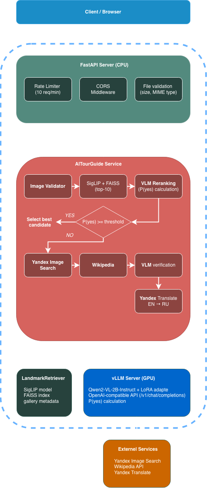
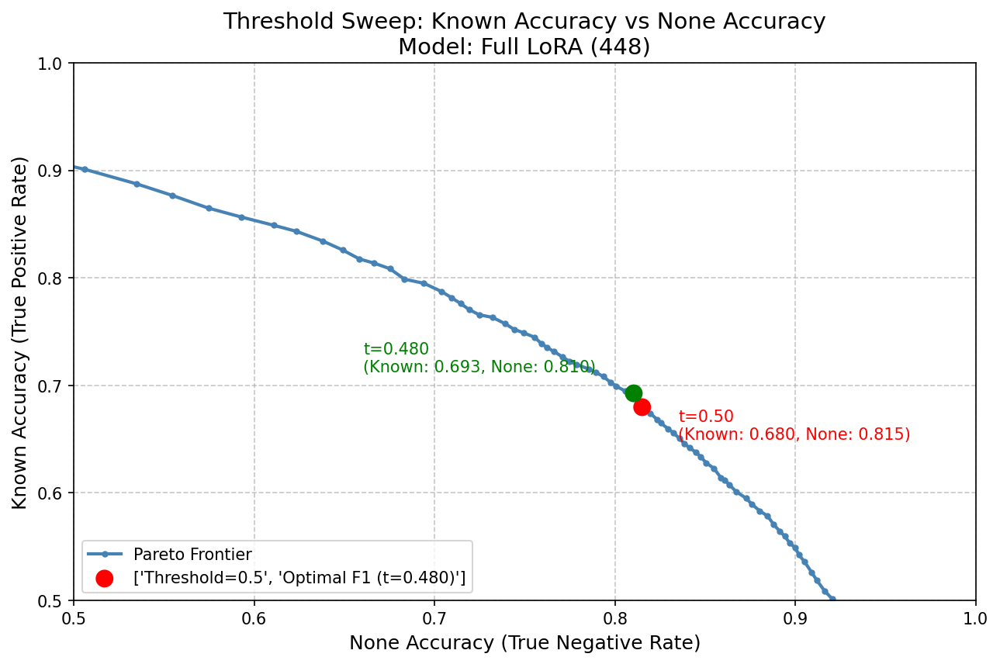

# 🏛️ AI Tour Guide

**Распознавание достопримечательностей по фотографии на русском языке.**
Загружаете фото — получаете название объекта, экскурсионное описание и калиброванную уверенность модели. Если объект не из галереи, сервис честно отвечает «не знаю», а не выдумывает ответ.

<div align="center">


</div>

---

## Коротко о результате

Задача — **open-set распознавание достопримечательностей**: не просто найти ближайший объект в базе, а понять, есть ли он там вообще. Решение — двухступенчатый пайплайн **retrieve → rerank** с дообученным vision-language-ранкером.

| | Hit@1 | MRR | Unknown accuracy |
|---|:---:|:---:|:---:|
| Retrieval baseline (SigLIP + FAISS) | 60.74% | 0.711 | — |
| Zero-shot Qwen2-VL (без дообучения) | 26.98% | 0.465 | 1.51% |
| **LoRA-reranker (итоговая модель)** | **73.51%** | **0.833** | **81.76%** |

> «Из коробки» VLM в роли ранкера уступает ретриверу — 26.98% против 60.74% Hit@1. После LoRA-дообучения (попарное сравнение фото, 448px) он становится лучшим компонентом пайплайна: **+12.8 п.п. Hit@1** над ретривером и рост распознавания «неизвестных» объектов с ~0 до **81.8%**.

**Что внутри:**

- **Fine-tuning VLM** — LoRA-дообучение `Qwen2-VL-2B-Instruct` для reranking, sweep по гиперпараметрам с трекингом в MLflow, Flash Attention 2, gradient checkpointing.
- **Open-set / калибровка** — детекция «неизвестных» объектов через P(yes) из logprobs, подбор порога по Pareto-фронту, метрики F1-macro / AUROC / Brier.
- **Двухступенчатый RAG** — SigLIP-эмбеддинги + FAISS для отбора кандидатов, VLM для точного попарного ранжирования.
- **Пайплайн данных** — сбор, фильтрация, VLM-каптионинг и генерация описаний (6 шагов, S3, майнинг hard-negative «unknown»).
- **Продакшен-сервинг** — асинхронный FastAPI поверх vLLM (OpenAI-совместимый API) с online-квантизацией модели при загрузке, fallback в интернет-поиск.
- **MLOps** — Docker Compose, Prometheus + Grafana + Loki, структурированные логи с correlation ID, CI/CD (ruff → pytest → GHCR → деплой по SSH).

---

## Содержание

- [Как это работает](#как-это-работает)
- [Результаты](#результаты)
- [Обучение и данные](#обучение-и-данные)
- [Сервинг и MLOps](#сервинг-и-mlops)
- [Быстрый старт](#быстрый-старт)
- [API](#api)
- [Системные требования](#системные-требования)
- [Структура проекта](#структура-проекта)
- [Разработка](#разработка)
- [Лицензия](#лицензия)

---

## Как это работает



Пайплайн построен по принципу «дёшево отобрать → дорого уточнить», с graceful-деградацией в интернет-поиск:

1. **SigLIP + FAISS — retrieval.** Изображение кодируется энкодером `google/siglip-base-patch16-224`, по FAISS-индексу (`IndexFlatIP`, cosine на L2-нормализованных векторах) отбираются top-10 кандидатов из галереи. Быстро (< 0.3 с), но неточно на первом месте.
2. **Qwen2-VL-2B LoRA — reranking.** Дообученный VLM попарно сравнивает фото-запрос с каждым кандидатом и отвечает Yes/No. Из logprobs извлекается вероятность `P(yes) = softmax(logit_yes, logit_no)` — это и есть калиброванная уверенность. Лучший кандидат выбирается по максимуму P(yes).
3. **Открытое множество (unknown).** Если `P(yes) < threshold` даже у лучшего кандидата — объекта, скорее всего, нет в галерее. Порог подобран по валидации (см. [Результаты](#результаты)).
4. **Fallback в интернет.** При низкой уверенности параллельно запускается Yandex Image Search → Wikipedia → повторная VLM-верификация → перевод описания Yandex Translate (EN → RU).

Подробнее — в [docs/ARCHITECTURE.md](docs/ARCHITECTURE.md).

---

## Результаты

### Качество ранжирования

Валидация: **13 911** примеров (5 746 known / 8 165 unknown), порог для «unknown» = 0.5.

| Метрика | Retrieval baseline<br>(SigLIP + FAISS) | Zero-shot<br>Qwen2-VL | **LoRA-reranker<br>(лучшая модель)** |
|---|:---:|:---:|:---:|
| **Hit@1** | 60.74% | 26.98% | **73.51%** |
| **Hit@3** | 76.35% | 53.86% | **91.70%** |
| **MRR** | 0.711 | 0.465 | **0.833** |
| **Unknown accuracy** | — | 1.51% | **81.76%** |
| **Unknown AUROC** | — | 0.587 | **0.809** |
| **Brier score** ↓ | — | 0.330 | **0.061** |

> Recall@10 ретривера — 93.9%: реранкер работает внутри этого «потолка» и почти полностью восстанавливает правильный порядок (Hit@3 91.7%). Brier score 0.33 → 0.06 показывает, что дообучение не только повысило точность, но и **откалибровало** уверенность.

**Лучшая модель:** `Qwen2-VL-2B-Instruct` + full LoRA (`q,k,v,o,gate,up,down_proj`), r=16, α=32, lr=2e-5, разрешение 448px.

### Open-set: выбор рабочего порога

Порог «known / unknown» — это компромисс между точностью на известных объектах (TPR) и отсевом неизвестных (TNR). Оптимальная точка выбрана по F1-macro на Pareto-фронте:



При оптимальном пороге **0.4226**:

| Метрика | Значение |
|---|:---:|
| F1 known | 70.81% |
| F1 unknown | 79.11% |
| **F1 macro** | **74.96%** |
| Known accuracy | 71.53% |
| Unknown accuracy | 78.55% |

### End-to-end (полный пайплайн, тестовая выборка)

Тест: **13 889** примеров, с fallback в интернет-поиск.

| E2E-метрика | Значение |
|---|:---:|
| Hit@1 | **61.86%** |
| MRR | **0.854** |
| Accuracy | 67.87% |
| Unknown accuracy | 72.92% |
| Latency P95 | 2.84 с |

---

## Обучение и данные

### Данные

Датасет собран end-to-end собственным пайплайном ([scripts/data_preparation/](scripts/data_preparation/)):

1. Поиск текстовых описаний объектов → 2. Скачивание изображений → 3. Текстовая фильтрация → 4. Валидация изображений, VLM-каптионинг и суммаризация → 5. Генерация экскурсионных описаний (YandexGPT) → 6. Сборка датасета.

Дополнительно: хранение в **S3** (boto3), майнинг «сложных unknown» (`create_hard_unknown_test.py`) для честной оценки open-set-поведения.

### Fine-tuning

- **Модель:** `Qwen2-VL-2B-Instruct`, дообучение через **LoRA** (PEFT). Формулировка задачи — попарная бинарная классификация «это тот же объект? Yes/No», уверенность берётся из logprobs токенов.
- **Оптимизации:** Flash Attention 2, gradient checkpointing, фиксированное разрешение тайла 448×448, early stopping со стратифицированной валидацией по ходу обучения.
- **Эксперименты:** sweep по `r`, `α`, `lr`, набору `target_modules` (attn-only против full) и разрешению; всё логируется в **MLflow** (параметры, train loss, eval-метрики, артефакты). Результаты прогонов — в [scripts/experiments/results/](scripts/experiments/results/).
- **Оценка:** ранжирование (Hit@k, MRR, nDCG, median rank), open-set (Unknown accuracy, AUROC, FPR@95TPR, F1-macro), калибровка (Brier), а также E2E-оценка с замером latency.

Как запустить обучение, форматы данных и troubleshooting — в [scripts/experiments/README.md](scripts/experiments/README.md).

### Экспорт и квантизация

В продакшене LoRA-адаптер сливается с базовой моделью, а квантизация выполняется **на лету при загрузке в vLLM** (online) — этот вариант дал лучший баланс качества, VRAM и простоты деплоя. Оффлайн-подходы (AWQ, GGUF/llama.cpp) были проверены как альтернативы (`export_model_*.py`, `test_gguf_model.py`), но в прод не пошли.

---

## Сервинг и MLOps

- **API:** асинхронный **FastAPI** (Uvicorn); reranking выполняется на внешнем **vLLM**-сервере через OpenAI-совместимый Chat Completions API, модель квантуется на лету при загрузке в vLLM. Сам API-сервер работает на CPU.
- **Надёжность:** in-memory rate limiting (10 req/60s на IP), валидация файлов (размер, MIME), таймауты, health-checks компонентов, graceful-fallback при недоступности vLLM.
- **Наблюдаемость:** метрики Prometheus на `/metrics` (счётчики запросов, гистограммы confidence и latency по этапам), дашборды **Grafana**, агрегация логов **Loki + Promtail**, структурированные JSON-логи с correlation ID на каждый запрос.
- **CI/CD** ([.github/workflows/ci-cd.yml](.github/workflows/ci-cd.yml)): линтинг (ruff) → тесты (pytest, unit + integration) → сборка и публикация Docker-образа в GHCR → деплой по SSH.
- **Контейнеризация:** мультисервисный `docker-compose` (API, Prometheus, Grafana, Loki, Promtail).

---

## Быстрый старт

```bash
# 1. Клонируйте репозиторий
git clone https://github.com/Anastasia-Slesarenko/AITourGuide.git
cd AITourGuide

# 2. Создайте виртуальное окружение
python -m venv venv
source venv/bin/activate  # Windows: venv\Scripts\activate

# 3. Установите зависимости
pip install -r requirements-prod.txt

# 4. Настройте переменные окружения
cp .env.example .env
# Отредактируйте .env: YC_FOLDER_ID, YC_API_KEY

# 5. Соберите FAISS-индекс
make build-index

# 6. Запустите API-сервер
make run
```

API доступен на `http://localhost:8000`, документация — `http://localhost:8000/docs`.

### Docker

```bash
make docker-up   # API + Prometheus + Grafana + Loki
```

> **Reranking** требует отдельного vLLM-сервера с `Qwen2-VL-2B-Instruct` + LoRA-адаптером (GPU). Без него API отдаёт результат retrieval-ступени и переходит в degraded-режим.

---

## API

| Метод | Путь | Описание |
|-------|------|---------|
| `POST` | `/v1/predict` | Распознать достопримечательность |
| `GET` | `/v1/health` | Статус сервиса и компонентов |
| `GET` | `/v1/info` | Метрики и конфигурация |
| `GET` | `/metrics` | Prometheus-метрики |
| `GET` | `/docs` | Swagger UI |

Пример запроса:

```bash
curl -X POST http://localhost:8000/v1/predict \
  -F "file=@photo.jpg"
```

Пример ответа:

```json
{
  "name": "Исаакиевский собор",
  "description": "Исаакиевский собор — крупнейший православный храм Санкт-Петербурга...",
  "confidence": 0.923,
  "source": "retrieval",
  "unknown": false
}
```

Полный референс (все поля, коды ошибок, примеры на Python) — в [docs/API.md](docs/API.md).

---

## Системные требования

<details>
<summary><b>Продакшен (API-сервер, CPU)</b></summary>

| Ресурс | Минимум | Рекомендуется |
|--------|---------|---------------|
| CPU | 4 ядра | 8+ ядер |
| RAM | 8 GB | 16 GB |
| Диск | 10 GB | 20 GB |
| GPU | ❌ Не требуется | ✅ Только для vLLM-сервера |
| Python | 3.11 | 3.11 |

</details>

<details>
<summary><b>vLLM-сервер (VLM reranking, GPU)</b></summary>

| Ресурс | Требование |
|--------|-----------|
| GPU | NVIDIA, ≥ 8 GB VRAM (RTX 3080 / A10 / T4) |
| CUDA | 12.x |
| RAM | 16 GB |

Для обучения: NVIDIA GPU ≥ 16 GB VRAM (рекомендуется 24 GB+), 32 GB RAM.

</details>

---

## Структура проекта

```
AITourGuide/
├── src/
│   ├── api/          # FastAPI: роуты, middleware, зависимости, фронтенд
│   ├── core/         # Конфигурация, логирование, Prometheus-метрики
│   ├── rag/          # FAISS-индекс, LandmarkRetriever (SigLIP)
│   └── services/     # Оркестратор, YandexSearch, Wikipedia, Translator
├── scripts/
│   ├── experiments/      # Обучение (LoRA), оценка, калибровка, экспорт
│   └── data_preparation/ # Сбор и подготовка датасета (6 шагов, S3)
├── docker/           # Dockerfile, compose, Prometheus, Grafana, Loki
├── config/           # YAML-конфиги (base / development / production)
├── tests/            # Unit и integration тесты
├── requirements-prod.txt  # Зависимости для продакшена (inference)
└── requirements-dev.txt   # Зависимости для обучения и экспериментов
```

---

## Разработка

```bash
make install-dev    # Все зависимости (dev + эксперименты)
make test           # Тесты
make lint           # Линтинг (ruff)
make format         # Форматирование
```

---

## Лицензия

[MIT License](LICENSE)
